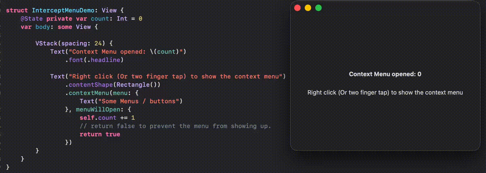

# SwiftUI_InterceptMenu
A demo of intercepting menu/context menu to perform simultaneous actions or temporary disablement.

For more details, please refer to my blog [SwiftUI: Intercept-able Picker / Menu / Context Menu](https://medium.com/@itsuki.enjoy/swiftui-intercept-able-picker-menu-context-menu-efc9e562c8ea)

Sample Usage:

```swift
struct InterceptMenuDemo: View {
    @State private var count: Int = 0
    var body: some View {

        VStack(spacing: 24) {
            Text("Context Menu opened: \(count)")
                .font(.headline)

            Text("Right click (Or two finger tap) to show the context menu")
                .contentShape(Rectangle())
                .contextMenu(menu: {
                    Text("Some Menus / buttons")
                }, menuWillOpen: {
                    self.count += 1
                    // return false to prevent the menu from showing up.
                    return true
                })
        }
    }
}
```




### Approaches that won't work

1. Overlay A UIView/NSView subclass
    - The view will take up the full space, not just the view it is attached to.
    - If the view has any other gestures attached, they will all be "disabled" (okay, technically speaking, still enabled, just never get triggered), because right now we have something sitting on top of them!


2. Add A Simultaneous Gesture Recognizer
   - Context menu never opened because the gesture recognizer eats the gesture that context menu is triggered based on


